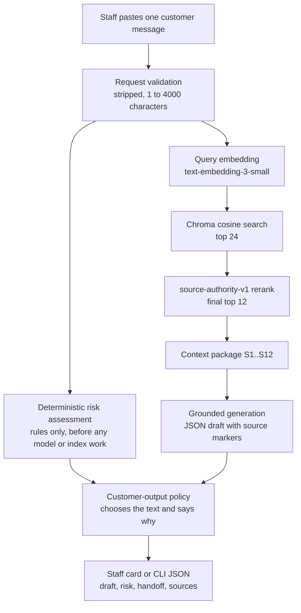

# customer-claims-rag-assistant

A staff-assist RAG triage tool for customer claims. A support agent pastes one customer message and gets a draft reply, a deterministic risk assessment with handoff guidance, and the knowledge-base passages the draft rests on. The agent reviews and sends; the tool decides nothing about refunds or compensation.

The company is **FoodFlow, a fictional food-delivery service**. The knowledge base, prompts, UI and customer drafts are in Russian; the code, configuration and documentation are in English.

> Кратко: учебный RAG-ассистент для первичной обработки обращений вымышленного сервиса FoodFlow. Для сотрудника поддержки: черновик ответа, детерминированная оценка риска, источники из базы знаний. Решение всегда принимает сотрудник.

| | |
|---|---|
| Production corpus | 10 documents, 216 chunks, release `foodflow-10doc-release-v2` |
| Retrieval | `text-embedding-3-small` -> Chroma (cosine) -> pool of 24 -> `source-authority-v1` rerank -> final 12 |
| Safety | rule-based risk floor computed before retrieval; fixed texts for critical categories; model drafts checked by a text policy |
| Retrieval quality (60 frozen cases) | Hit@4 0.897, primary hit@4 0.759, MRR 0.715; expected primary source reachable in the pool for 56 of 57 cases |
| Reproducibility | canonical corpus manifest with hashes, release gate that recomputes the index identity from the stored records, secret-free CI on Ubuntu and Windows |
| License | [MIT](LICENSE) |

## What problem it solves

A first-line agent reading a complaint has to do several things at once: classify it, find the applicable rules, avoid promises the company has not made (a refund, a deadline, an admission of fault), and notice the few messages that are not routine (a health symptom, a foreign object in food, fraud, a threat, a data leak). A language model is good at drafting and at finding passages, and unreliable at the second and third. This project keeps those apart: retrieval and drafting are probabilistic and reviewed by a person; the safety-relevant decisions are deterministic code that a model cannot override.

**Scope.** It is a single-shot assist tool, not a ticketing or helpdesk platform. There is no database, no authentication, no conversation or case history, no document upload, no feedback loop and no deployment; the Streamlit UI and the `answer-claim` CLI each process one message. It has no access to orders, payments or couriers.

## Architecture and request flow



1. **Validation.** The message is stripped and bounded (4000 characters) by the request model, below any UI.
2. **Risk assessment.** Deterministic rules produce exactly one assessment per request, before retrieval, so no later failure can lose it.
3. **Retrieval.** One query embedding, a cosine search for 24 candidates, a small deterministic rerank, 12 passages kept.
4. **Generation.** The model is asked for a JSON reply (`grounded_answer`, `insufficient_context` or `out_of_scope`) citing passages as `[S1]`..`[S12]`.
5. **Customer-output policy.** One function decides which text becomes the customer draft and records its provenance. Both the UI and the CLI are thin adapters over it and never see raw model text.
6. **Degradation.** If retrieval, context building or generation fails, the draft falls back to a deterministic text and the risk assessment is kept; the failure is reported as `failure_source`.

## Deterministic safety boundary

- **Risk floor.** `assess_deterministic_risk` returns a floor (`low` to `critical`) and a status: `rule_match`, `no_signal` or `unsupported_language`. A model can only ever raise a level. `no_signal` is reported as "risk not determined by rules", never as low risk, and a message that is not in Russian is not classified at all but routed to manual review.
- **Critical categories.** Health symptoms after eating, a dangerous foreign object, a mass incident, fraud indicators and a direct threat to staff are critical: they get a fixed customer text and a priority handoff. Personal-data exposure (high or critical) gets a fixed text as well. The model's draft is not consulted for any of them. A hair or an unspecified foreign object in the food is high, not critical: it needs a person but not a priority handoff.
- **Text policy for model drafts.** A draft for any other case is shown only if it passes checks that reject admissions of fault, promises of a refund, compensation or a deadline, statements that the application has registered, transferred or will review something (it does none of that), medical diagnoses and advice, requests for card numbers, CVV, PIN or SMS codes, and markup. A draft that fails is replaced by a verified template (`safety_replacement`).
- **Honest provenance.** Every answer carries `answer_provenance`, and `citations` lists sources only when the accepted text really is the model's grounded draft; retrieved passages that do not support the text are listed separately as `retrieved_materials`.
- **What this is not.** Retrieval supports the staff member's context; it is never the basis of a safety decision. The rules are a conservative lexicon, not a classifier (see the limitations).

[`deliverables/evidence/`](deliverables/evidence/README.md) shows the behaviour in 14 recorded situations, including a model draft that promises a refund and diagnoses a symptom being replaced, and an injection attempt around a health complaint that changes nothing.

## Retrieval design

- **Corpus.** Ten cleaned Markdown documents (service overview, delivery, orders, refunds, compensation, food quality, complaint procedure, escalation and risk rules, response style, FAQ). A structure-aware chunker with a `cl100k_base` token budget produces 216 chunks with typed metadata (document, section, chunk type, priority).
- **Search.** Dense retrieval only: `text-embedding-3-small` vectors in a persistent Chroma collection (cosine). The contract is frozen in `configs/retrieval/vector_pool_expansion_v1.json`: fetch 24, pool 24, final 12, similarity threshold 0.0 (no filtering, on purpose).
- **Rerank.** `source-authority-v1` adds a bonus of at most 0.03 by document type (policy and escalation highest, FAQ and templates none), with deterministic tie-breaking. It cannot overtake a large similarity gap.
- **How the configuration was chosen.** The candidates below were each judged on the frozen 60-case set against written guardrails (no regression on high and critical cases). The reports are kept as history under `tests/`; see [`deliverables/README.md`](deliverables/README.md).

| Experiment | Outcome |
|------------|---------|
| Source-authority rerank | accepted |
| Candidate pool 12 -> 24 | accepted: primary reachability 51/57 -> 56/57, critical 6/8 -> 8/8, high 13/15 -> 15/15 |
| Hybrid BM25 + vector (RRF) | rejected: failed its guardrails |
| 15-document expansion (adds documents 11 to 15) | rejected: harmful regressions on high and critical cases |
| Deeper pool with a per-document cap (36, cap 4) on the expanded corpus | accepted only as a partial candidate-generation repair |
| Two further repairs of the expansion (atomic risk units, atomic threat units) | rejected |

Documents 11 to 15 therefore stay out of the production corpus; the deterministic layer covers payment data, personal data, threats, hazards and health with fixed texts that do not depend on them.

## Reproducible canonical corpus and index

- `configs/corpus/foodflow_production_v1.json` is the only place the corpus is selected. It records the SHA-256 of every source document, the expected chunk count (216), a **chunk payload digest** (`f46fa977...`, chunk ids, texts, metadata, independent of the embedding model) and a **corpus fingerprint** (`aa1005e1...`, the same plus the embedding model name). Every Markdown file in the source directory must be declared as included or excluded.
- `configs/release/production_posture.json` (schema 2.0.0) names release `foodflow-10doc-release-v2` and the index path `data/04_index_production`.
- The index is a **build artifact**: it is not committed and is built from the repository by one documented command ([`docs/07_index_provisioning.md`](docs/07_index_provisioning.md)). Only the last step, embedding, needs `OPENAI_API_KEY` and network, and the canonical build reads the key from the process environment only.
- `validate-release-posture` is the release gate. It recomputes the chunk count, payload digest, corpus fingerprint, collection content digest and vector dimensions **from the stored records**, so a manifest edited to claim the approved identity, a stale index, an edited chunk or vector, or a wrong dimension are all refused. Exit status `0` is only ever returned when the index content was verified; `answer-claim`, the UI and the container run the same validation before serving.
- What it cannot prove: that the stored vectors came from the model the manifest names. Only the configured model name, the dimension and the build-time digests can be checked offline ([`docs/06_release_posture.md`](docs/06_release_posture.md)).

## Evaluation results

Retrieval-only evaluation of the production index on the 60 frozen cases (`tests/01_test_questions.md`, `tests/02_expected_answers.md`), real embeddings, production configuration. Full derivation, per-case rows and provenance: [`deliverables/evidence/retrieval_summary.md`](deliverables/evidence/retrieval_summary.md).

| Metric | Value | Cases |
|--------|------:|------:|
| Hit@4 (any expected source in the first 4) | 0.897 | 52/58 |
| Primary hit@4 (an expected primary source in the first 4) | 0.759 | 44/58 |
| Primary hit@1 | 0.397 | 23/58 |
| MRR | 0.715 | 60 |
| Expected primary source in the 24-candidate pool | 0.982 | 56/57 |

- Against the baseline accepted before the corpus corrections, there is **no per-case regression**; one case improved (T011, high risk: primary source now in the first 4), so primary hit@4 moved from 0.741 to 0.759.
- Pool reachability for the safety-relevant slices: critical 8/8, high 15/15.
- The only case whose expected primary source is outside the candidate pool is **T004**. Some high and critical cases (for example T040, T044, T047) are reachable but ranked below position 4; for the critical ones the fixed customer text and priority handoff do not depend on retrieval.

How to read these numbers: they measure retrieval, not answer quality. The 60 cases also guided the choice of the retrieval configuration, so they are a regression baseline, not an estimate of performance on unseen messages. Model answers are not scored anywhere in this repository.

## Running locally

Python 3.12 or newer. The dependencies are declared once, in `pyproject.toml`.

```powershell
git clone https://github.com/eliv1982/customer-claims-rag-assistant.git
cd customer-claims-rag-assistant
py -3.12 -m venv .venv
.\.venv\Scripts\Activate.ps1          # Linux/macOS: python3.12 -m venv .venv && source .venv/bin/activate
python -m pip install -e ".[dev]"
python -m pip check
python -m pytest -p no:cacheprovider  # needs no key, no network, no index
```

A fresh clone has the corpus, the manifests, the evidence and the tools, but not the index. To run the application:

1. Export a key **on purpose** in the shell that builds: `$env:OPENAI_API_KEY = "<key>"`.
2. Build the index (dry run first, then the build; embedding 216 chunks is a small request). The exact commands are in [`docs/07_index_provisioning.md`](docs/07_index_provisioning.md):

   ```powershell
   python -m customer_claims_rag.cli.build_index --corpus-manifest configs/corpus/foodflow_production_v1.json --index-dir data/04_index_production --collection customer_claims --embedding-model text-embedding-3-small --rebuild
   ```

3. Check the release: `validate-release-posture` (exit status `0`, `release_can_proceed=yes`).
4. Ask:

   ```powershell
   answer-claim --message "Заказ FF-52525 опоздал на 40 минут. Положена ли компенсация?"
   python -m streamlit run src/customer_claims_rag/ui/streamlit_app.py
   ```

Credentials: `answer-claim` and the UI read `OPENAI_API_KEY` from the process environment or a local `.env` (the process environment wins; `.env` is gitignored, `.env.example` has no secrets). The canonical index build and the Docker launcher use the process environment only, so a stale `.env` cannot start a paid run. Production retrieval settings come from the release descriptor; `RAG_INDEX_DIR` affects only the development and evaluation CLIs.

## Tests and CI

- **Default suite** (about 2,800 tests): hermetic. No credential, no `.env`, no tokenizer download, no built index, no network; a socket guard in the test process and in ordinary child interpreters fails the session on any outbound attempt. Tests of gitignored local artifacts (`local_artifact`) skip with the missing path as the reason, and fail if the artifact exists but is stale.
- **Two tokenizer lanes.** The default lane uses an offline stand-in for `cl100k_base`; a separate lane (`python -m pytest --real-tiktoken -m real_tiktoken`) runs against the real vocabulary and checks the canonical chunk topology and fingerprints. Serving a request never loads a tokenizer: a test drives the real LangChain and OpenAI clients over a stubbed transport with an empty cache and every tokenizer entry point trapped.
- **CI** (GitHub Actions, no secrets, read-only permissions): the default suite on Ubuntu and Windows and the real-tokenizer lane on Ubuntu, each in a fresh virtual environment with `pip check`. Details: [`docs/09_ci_contract.md`](docs/09_ci_contract.md).
- **Evidence tests.** The committed evidence is checked against the committed release configuration, and on a machine with the production index it is re-derived and compared byte for byte.

## Docker and release workflow

The Streamlit UI runs in a hardened container: non-root user, read-only root filesystem, dropped capabilities, port published on loopback only, the index mounted from the host (never copied into the image), and a start-up order that runs the full release validation before the server starts. Compose is started only through the launcher, which takes the key from the process environment and ignores `.env`:

```powershell
$env:OPENAI_API_KEY = "<key>"
python scripts/release_compose.py build
python scripts/release_compose.py run --rm streamlit validate-release-posture
python scripts/release_compose.py up -d --wait
```

Open http://127.0.0.1:8501. The mount is writable because Chroma writes to its own SQLite file even to read. See [`docs/08_docker_runbook.md`](docs/08_docker_runbook.md), including how the image was verified by hand (CI does not build it).

## Known limitations

- **Scope.** Single-shot staff assist: no persistence, authentication, case history, ticketing or deployment. The knowledge base is fictional and the rules are tuned to Russian text; other languages are routed to manual review.
- **Retrieval.** T004 stays outside the 24-candidate pool. T040, T044 and T047 (and T016, T053) are reachable but ranked below position 4: pool expansion fixed candidate generation, not ordering. Retrieval is dense-only; there is no query rewriting.
- **Rule coverage and precision.** The risk rules are a conservative, pattern-based lexicon, not a classifier. The committed evidence snapshot was recorded before the Stage 2I rule fixes: it still shows two frozen cases labelled high, T039 (a hair in a salad) and T053 (the third wrong dish in a row), as "risk not determined", and T026 (a closed, leak-free container) as a critical health case. Since then T039 is a `high` match (`unconfirmed_foreign_object`: hair or an unspecified foreign object in the food, kept apart from the critical dangerous-object rule), and T026 is a `medium` refund request: health terms must start at a word start (`протекает` is not `отек`), and a product, storage or weather temperature is not a body temperature. T053 stays a documented gap. Policy 08 makes a repeated significant failure high, but that is a judgement over several deliveries, and the message states no failure the rules know, so a rule for it would be fitted to this one case; it comes out as "risk not determined", staff must judge it, and the UI says so. Food, meal and "after" words in the rules are explicit word forms, never bare stems, so `супермаркет`, `супруг`, `единственный`, `соблюдены` and `последний` are not food or consumption evidence. The lexicon still over-escalates where it cannot tell: a bare "температура" after a meal counts as a symptom. Foreign-object coverage is lexical, not a dictionary: glass, needles, shards, pieces of metal, hair and a generic "посторонний/инородный предмет" are covered, while wire, staples, stones, bones, film, thread, insects, `оргстекло`, arbitrary dish names and derived adjectives (`салатовый`, `продуктовый`) are not. These are accepted limitations to be handled by rule changes, not by the model.
- **Evaluation.** Retrieval only, on 60 cases that also guided configuration; no answer-quality benchmark.
- **Embeddings.** Rebuilding the index needs an external OpenAI credential and spends embedding credit. That the stored vectors came from the named model cannot be proven offline beyond the configured name, dimension and digests.
- **Tokenizer.** Building and verifying the canonical chunks needs the `cl100k_base` vocabulary (downloaded once); serving does not.
- **Runtime.** The container is verified by hand, not in CI; the UI is local (loopback) and unauthenticated by design.

## Repository structure

```text
configs/            corpus manifest, release descriptor, retrieval and reranker contracts
data/02_clean_markdown/   cleaned knowledge-base documents (01-10 production, 11-15 experimental)
data/05_evaluation/       tracked results of historical experiments (generated outputs are gitignored)
deliverables/       final acceptance evidence (current) and the superseded Stage 5C package (historical)
docs/               scope and data-preparation records, release posture, provisioning, Docker, CI
experiments/        frozen historical corpus snapshot and the rejected repair experiments
prompts/            system prompt and RAG prompt template
scripts/            release launcher, container entrypoint, evidence capture, tokenizer provisioning
src/customer_claims_rag/
  ingestion/        loading, chunking, canonical corpus
  retrieval/        embeddings, Chroma store, retriever, reranker, fingerprints, manifest
  risk/             deterministic risk rules and invariants
  generation/       context, prompt, parser, validator, fallbacks
  application/      pipeline, customer-output policy, templates, factory
  release/          release posture and readiness (the gate)
  evaluation/       retrieval evaluation and experiment harnesses
  cli/, ui/         answer-claim, build/validate/evaluate commands, Streamlit app
tests/              unit and integration tests, the 60 frozen cases, historical experiment reports
```

## Development approach

The project was built in stages, each closed against written acceptance criteria and re-checked before the next began.

- **Retrieval by experiment.** Each change to retrieval (reranking, pool depth, hybrid search, corpus expansion, atomic-unit repairs) was a separate experiment on a frozen regression set with guardrails fixed in advance; rejected experiments are kept and documented rather than deleted.
- **Safety as code.** The safety rules are deterministic, tested against adversarial and regression inputs, and structurally separate from the model: the assessment is computed once, before retrieval, and generation cannot lower it.
- **Identity you can verify.** Corpus manifest, chunk payload digest, corpus fingerprint and a release gate that recomputes them from the stored index. The release path never depends on an archive or on a maintainer's machine.
- **Clean-clone reproducibility.** One dependency declaration, a hermetic test suite, an offline tokenizer stand-in plus a real-tokenizer lane, and CI that proves both from an empty environment.
- **Independent validation of boundaries.** Mutation-style tests for the release gate (edited manifests, stale or altered stores), contract tests for the container and the credential rules, and evidence whose numbers are checked against the configuration they describe.
- **Hardening.** A hardened container, bounded embedding input, and evidence that labels history as history instead of rewriting it.

## License

MIT, see [LICENSE](LICENSE).
